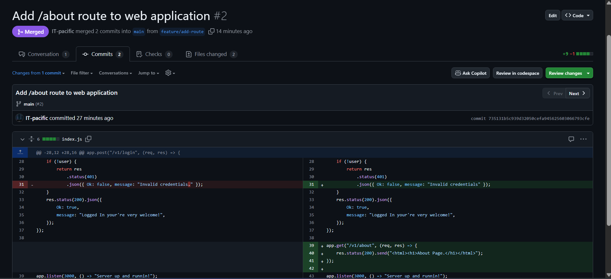

#### Todo 2

**Pull request**

[about-page-route-pr](https://github.com/IT-pacific/my-web-app/pull/2/commits/735131b5c939d32050cefa945625603066793cfe)

**Pr status**

**Summary**

In this task, I created a feature branch and added a new /about route to the Node.js application. After pushing the branch and opening a pull request, I simulated the review process using my own account. A review comment requested an additional improvement, so I returned to the feature branch, updated the route code, committed the fix, and pushed again. Once the changes were verified, I approved the pull request and merged it into the main branch.
